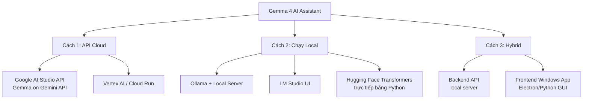

# 🤖 Nghiên Cứu: Xây Dựng Trợ Lý AI Ảo Trên Windows Dùng Gemma 4

> **Mục tiêu:** Tổng hợp các phương pháp, công nghệ và kiến trúc để xây dựng một trợ lý AI / trợ lý ảo chạy trên Windows, sử dụng model **Gemma 4** của Google DeepMind.

---

## 1. 📌 Tổng Quan Về Gemma 4

**Gemma 4** là thế hệ mới nhất trong dòng model mã nguồn mở của Google DeepMind (2025), kế thừa từ cùng nền tảng nghiên cứu tạo ra Gemini.

### Điểm nổi bật của Gemma 4:
| Đặc điểm | Chi tiết |
|---|---|
| **Loại model** | Multimodal (Text + Image + Audio*) |
| **Context window** | 128K tokens (E2B/E4B) · 256K tokens (26B A4B/31B) |
| **Ngôn ngữ** | Hỗ trợ 140+ ngôn ngữ (bao gồm Tiếng Việt) |
| **License** | Apache 2.0 (mã nguồn mở, miễn phí thương mại) |
| **Kích thước** | E2B · E4B · 26B A4B (MoE) · 31B |
| **Khả năng** | Chat, Function Calling, Vision, Audio*, Thinking |
| **Framework** | Hugging Face, Keras, Gemma Library, Ollama |

> *Audio chỉ hỗ trợ trên E2B và E4B

### Các phiên bản Gemma 4 (sizes theo tài liệu chính thức Google DeepMind):

| Model | Kiến trúc | Params (hiệu quả) | Params (tổng) | Context | Modality |
|---|---|---|---|---|---|
| **Gemma 4 E2B** | Dense | 2.3B | 5.1B | 128K | Text + Image + Audio |
| **Gemma 4 E4B** | Dense | 4.5B | 8B | 128K | Text + Image + Audio |
| **Gemma 4 26B A4B** | MoE (8/128 experts) | 3.8B active | 25.2B total | 256K | Text + Image |
| **Gemma 4 31B** | Dense | — | 30.7B | 256K | Text + Image |

> **"E"** = Efficient (tối ưu cho on-device/laptop). **"A4B"** = 4B params active khi inference — chạy nhanh gần bằng model 4B dù tổng có 26B.

---

## 2. 🛣️ Các Cách Tiếp Cận Xây Dựng AI Assistant Trên Windows

Có **3 hướng chính** để dùng Gemma 4 trên Windows:



---

## 3. 🔧 Cách 1: Dùng Gemma Qua Gemini API (Cloud)

### Ưu điểm:
- Không cần GPU mạnh
- Luôn dùng model mới nhất
- Dễ triển khai nhanh
- Free tier có sẵn

### Cách dùng:

**Bước 1:** Lấy API Key tại [Google AI Studio](https://aistudio.google.com)

**Bước 2:** Cài SDK:
```bash
pip install google-genai python-dotenv
```

**Bước 3:** Code mẫu Python:
```python
import os
from dotenv import load_dotenv
from google import genai
from google.genai import types

load_dotenv()
client = genai.Client(api_key=os.getenv("GEMINI_API_KEY"))

# Gemma 4 trên Gemini API (hỗ trợ chính thức 2 model)
# gemma-4-31b-it   → Dense 31B, mạnh nhất
# gemma-4-26b-a4b-it → MoE 26B (4B active), nhanh hơn

chat = client.chats.create(
    model="gemma-4-31b-it",
    config=types.GenerateContentConfig(
        system_instruction="Bạn là trợ lý AI thông minh người Việt Nam. Luôn trả lời bằng Tiếng Việt.",
        temperature=1.0,
        top_p=0.95,
        top_k=64,
    )
)

print("🤖 Trợ lý AI Gemma 4 - Gõ 'quit' để thoát")
while True:
    user_input = input("Bạn: ")
    if user_input.lower() == 'quit':
        break
    response = chat.send_message(user_input)
    print(f"AI: {response.text}\n")
```

---

## 4. 🖥️ Cách 2: Chạy Gemma 4 Local Trên Windows (Ollama)

### Đây là cách tốt nhất để có trợ lý AI chạy hoàn toàn offline!

### Bước 1: Cài Ollama cho Windows

Tải tại: [https://ollama.com/download](https://ollama.com/download)

Sau khi cài, Ollama chạy như một local server tại `http://localhost:11434`

### Bước 2: Tải model Gemma 4

```bash
# Tải Gemma 4 E4B - khuyến nghị (4.5B effective, Text+Image+Audio)
ollama pull gemma4:4b

# Hoặc Gemma 4 E2B - nhẹ nhất, chạy mọi máy
ollama pull gemma4:2b

# Hoặc Gemma 4 26B A4B - MoE, chạy nhanh hơn 31B dense
ollama pull gemma4:27b

# Hoặc Gemma 4 31B - mạnh nhất, cần RAM lớn
ollama pull gemma4:31b
```

> [!TIP]
> Kiểm tra tên tag chính xác tại: [https://ollama.com/library/gemma4](https://ollama.com/library/gemma4)

### Bước 3: Chạy Chat Trực Tiếp
```bash
ollama run gemma4:4b
```

### Bước 4: Tích hợp vào App Python qua Ollama API
```python
import requests
import json

OLLAMA_URL = "http://localhost:11434/api/chat"

def chat_with_gemma4(messages: list) -> str:
    payload = {
        "model": "gemma4:4b",
        "messages": messages,
        "stream": False
    }
    response = requests.post(OLLAMA_URL, json=payload)
    data = response.json()
    return data["message"]["content"]

# Conversation history
history = [
    {
        "role": "system",
        "content": "Bạn là trợ lý AI người Việt. Hãy luôn trả lời bằng Tiếng Việt."
    }
]

print("🤖 Trợ lý AI Gemma 4 Local - Nhập 'quit' để thoát")
while True:
    user_input = input("Bạn: ")
    if user_input.lower() == 'quit':
        break
    
    history.append({"role": "user", "content": user_input})
    response = chat_with_gemma4(history)
    history.append({"role": "assistant", "content": response})
    
    print(f"AI: {response}\n")
```

---

## 5. 🎨 Cách 3: Xây Dựng Windows Desktop App với GUI

### Stack khuyến nghị cho App Windows:

```
┌─────────────────────────────────────────┐
│         Windows Desktop App             │
│                                         │
│  Frontend: Python + CustomTkinter/      │
│            PyQt6 / Electron (Node.js)   │
│                                         │
│  Backend:  FastAPI local server         │
│                                         │
│  AI Engine: Ollama + Gemma 4 Local      │
│             hoặc Gemini API (Cloud)     │
└─────────────────────────────────────────┘
```

### Ví dụ App với CustomTkinter (Python GUI đẹp):

```bash
# Cài các package cần thiết
pip install customtkinter requests python-dotenv
```

```python
# ai_assistant_app.py
import customtkinter as ctk
import requests
import threading

# Cấu hình giao diện
ctk.set_appearance_mode("dark")
ctk.set_default_color_theme("blue")

OLLAMA_URL = "http://localhost:11434/api/chat"
MODEL = "gemma4:4b"

class AIAssistantApp(ctk.CTk):
    def __init__(self):
        super().__init__()
        self.title("🤖 Trợ Lý AI Gemma 4")
        self.geometry("900x700")
        self.history = []
        self.setup_ui()
    
    def setup_ui(self):
        # Header
        self.header = ctk.CTkLabel(
            self, 
            text="✨ Trợ Lý AI Gemma 4", 
            font=ctk.CTkFont(size=24, weight="bold")
        )
        self.header.pack(pady=15)
        
        # Chat area
        self.chat_display = ctk.CTkTextbox(
            self, width=860, height=500,
            font=ctk.CTkFont(size=13)
        )
        self.chat_display.pack(padx=20, pady=10)
        self.chat_display.configure(state="disabled")
        
        # Input frame
        self.input_frame = ctk.CTkFrame(self)
        self.input_frame.pack(fill="x", padx=20, pady=10)
        
        self.input_box = ctk.CTkEntry(
            self.input_frame, 
            placeholder_text="Nhập câu hỏi của bạn...",
            height=45,
            font=ctk.CTkFont(size=14)
        )
        self.input_box.pack(side="left", fill="x", expand=True, padx=(0, 10))
        self.input_box.bind("<Return>", self.send_message)
        
        self.send_btn = ctk.CTkButton(
            self.input_frame,
            text="Gửi",
            width=100,
            height=45,
            command=self.send_message
        )
        self.send_btn.pack(side="right")
    
    def add_message(self, role: str, text: str):
        self.chat_display.configure(state="normal")
        prefix = "🧑 Bạn:" if role == "user" else "🤖 AI:"
        self.chat_display.insert("end", f"\n{prefix}\n{text}\n")
        self.chat_display.configure(state="disabled")
        self.chat_display.see("end")
    
    def send_message(self, event=None):
        user_text = self.input_box.get().strip()
        if not user_text:
            return
        
        self.input_box.delete(0, "end")
        self.add_message("user", user_text)
        self.history.append({"role": "user", "content": user_text})
        
        # Gửi request trong thread riêng để không block UI
        thread = threading.Thread(target=self.get_ai_response)
        thread.daemon = True
        thread.start()
    
    def get_ai_response(self):
        try:
            payload = {
                "model": MODEL,
                "messages": [
                    {"role": "system", "content": "Bạn là trợ lý AI thông minh, thân thiện. Luôn trả lời bằng Tiếng Việt."},
                    *self.history
                ],
                "stream": False
            }
            response = requests.post(OLLAMA_URL, json=payload, timeout=60)
            ai_text = response.json()["message"]["content"]
            self.history.append({"role": "assistant", "content": ai_text})
            self.after(0, lambda: self.add_message("assistant", ai_text))
        except Exception as e:
            self.after(0, lambda: self.add_message("assistant", f"❌ Lỗi: {str(e)}"))

if __name__ == "__main__":
    app = AIAssistantApp()
    app.mainloop()
```

---

## 6. 🚀 Cách 4: Web App Trên Windows (Vite + React + Node.js)

Nếu muốn làm app dạng web chạy local trên Windows (giống ChatGPT):

### Kiến trúc:
```
Frontend: React/Vite (localhost:5173)
    ↕ HTTP API
Backend: Node.js / FastAPI (localhost:3001)
    ↕ Ollama API
Gemma 4 Local: Ollama (localhost:11434)
```

### Backend Node.js (Express):
```javascript
// server.js
const express = require('express');
const app = express();
app.use(express.json());

const OLLAMA_URL = 'http://localhost:11434/api/chat';

app.post('/api/chat', async (req, res) => {
  const { messages } = req.body;
  
  try {
    const response = await fetch(OLLAMA_URL, {
      method: 'POST',
      headers: { 'Content-Type': 'application/json' },
      body: JSON.stringify({
        model: 'gemma4:4b',
        messages: [
          { role: 'system', content: 'Bạn là trợ lý AI người Việt thông minh.' },
          ...messages
        ],
        stream: false
      })
    });
    
    const data = await response.json();
    res.json({ reply: data.message.content });
  } catch (err) {
    res.status(500).json({ error: err.message });
  }
});

app.listen(3001, () => console.log('🚀 Backend chạy tại http://localhost:3001'));
```

---

## 7. ⚙️ Yêu Cầu Phần Cứng Windows

| Model | Kiến trúc | File Size (Q4_K_M) | RAM tối thiểu | VRAM (GPU) | CPU-only? | Tốc độ phản hồi |
|---|---|---|---|---|---|---|
| Gemma 4 E2B | Dense | ~3 GB | 6 GB | 4GB (đủ) | ✅ Tốt | ~25-40 tok/s |
| Gemma 4 E4B | Dense | ~5 GB | 8 GB | 4GB (vừa đủ) | ✅ Tốt | ~15-25 tok/s |
| Gemma 4 26B A4B | MoE | ~14 GB | 16 GB | 8GB+ | ✅ Được | ~8-15 tok/s* |
| Gemma 4 31B | Dense | ~19 GB | 32 GB | 24GB+ | ⚠️ Rất chậm | ~1-2 tok/s |

> *26B A4B (MoE) chỉ active 3.8B params khi inference → **nhanh hơn 31B dense** đáng kể dù tổng params lớn hơn.

> [!TIP]
> Với Windows thông thường không GPU cao cấp, khuyến nghị dùng **Gemma 4 E4B** qua Ollama — chạy mượt trên máy có 8GB RAM.

> [!NOTE]
> **Q4_K_M** là mức lượng tử hóa 4-bit phổ biến nhất trên Ollama — giảm kích thước model ~4x so với FP16, chất lượng giảm rất ít. Ollama tự động dùng Q4_K_M khi tải model.

---

## 8. 🏗️ Roadmap Phát Triển App Phát Hành Cộng Đồng

### Cấu trúc thư mục dự án
```
AI_Assist/
├── .env                      # API keys (không commit)
├── .gitignore
├── requirements.txt
├── app.py                    # Entry point - GUI app chính
├── assistant.py              # CLI (đã xong - Phase 1)
├── core/
│   ├── gemini.py             # Gemini API wrapper + streaming
│   ├── history.py            # Lưu/tải lịch sử hội thoại (JSON)
│   ├── config.py             # Cấu hình app (model, theme, language...)
│   ├── rag.py                # RAG - đọc PDF/Word (Phase 3)
│   ├── voice.py              # STT + TTS (Phase 3)
│   └── web_search.py         # Tìm kiếm web (Phase 3)
├── ui/
│   ├── main_window.py        # Cửa sổ chính
│   ├── chat_bubble.py        # Widget bubble chat
│   ├── sidebar.py            # Sidebar danh sách hội thoại
│   └── settings_dialog.py    # Hộp thoại cài đặt
├── assets/
│   ├── icon.ico              # Icon app
│   └── themes/               # Theme tùy chỉnh
├── chat_history/             # Lịch sử hội thoại (auto-created)
└── dist/                     # .exe sau khi build (PyInstaller)
```

---

### ✅ Phase 1 – CLI MVP (HOÀN THÀNH)
- [x] Cài đặt môi trường Python + venv
- [x] Kết nối Gemini API với SDK `google-genai` mới nhất
- [x] Chat CLI multi-turn với `assistant.py`
- [x] Bảo mật API key qua `.env`

---

### 🚧 Phase 2 – Desktop GUI App (đang thực hiện)
- [x] Cài CustomTkinter
- [x] `core/gemini.py` – API wrapper với streaming
- [x] `core/history.py` – Lưu/tải hội thoại JSON
- [x] `core/config.py` – Quản lý cấu hình
- [x] `app.py` – GUI đầy đủ: sidebar + chat + settings
- [ ] Thêm icon app + đóng gói `.exe` bằng PyInstaller
- [ ] Test trên Windows sạch (không có Python)

---

### ✅ Phase 2.5 – Production Backend & User Management
- [x] Tách backend service riêng bằng FastAPI
- [x] JWT auth + phân quyền `admin/user`
- [x] DB riêng cho user (SQLAlchemy, chuyển Postgres qua env)
- [x] Cache riêng (Redis, fallback memory)
- [x] Health probes (`/health/live`, `/health/ready`)
- [x] App quản trị user riêng (`admin_app.py`)

---

### 📋 Phase 3 – Tính Năng Nâng Cao
- [x] **Streaming response** – Hiển thị text đang trả lời theo thời gian thực
- [ ] **Voice Input** – Microphone → Whisper STT → gửi vào chat
- [ ] **Voice Output** – Edge TTS đọc câu trả lời
- [ ] **RAG** – Đính kèm PDF/Word, AI đọc và trả lời dựa trên tài liệu
- [ ] **Vision** – Đính kèm ảnh, AI phân tích (Gemma 4 Vision)
- [ ] **Web Search** – DuckDuckGo API tìm kiếm thông tin thực tế
- [ ] **System Tray** – Chạy nền Windows, gọi bằng hotkey (Win+Space)

---

### 🚀 Phase 4 – Phát Hành Cộng Đồng
- [ ] Đóng gói `.exe` standalone bằng PyInstaller (không cần cài Python)
- [ ] Màn hình cài đặt API key lần đầu (onboarding wizard)
- [ ] Auto-update checker
- [ ] Hỗ trợ nhiều ngôn ngữ UI (i18n)
- [ ] Trang GitHub + README + hướng dẫn cài đặt
- [ ] Build installer bằng Inno Setup hoặc NSIS

---

## 9. 🔗 Các Tính Năng Có Thể Thêm Vào

```
Trợ lý AI Windows hoàn chỉnh
├── 💬 Chat đa lượt (Multi-turn conversation)
├── 🎙️ Voice Input (Whisper STT)
├── 🔊 Voice Output (TTS - Edge TTS / pyttsx3)
├── 📄 Đọc tài liệu (RAG với ChromaDB/FAISS)
├── 🌐 Tìm kiếm web (DuckDuckGo API)
├── 🖼️ Phân tích ảnh (Gemma 4 Vision)
├── ⌨️ Hotkey toàn hệ thống (pynput)
├── 📋 Clipboard AI (theo dõi clipboard)
├── 📅 Tích hợp Calendar / Reminder
└── 🔧 Function Calling (gọi Python functions)
```

---

## 10. � Đánh Giá Cấu Hình: i5-12500H + 32GB RAM + RTX 3050 Laptop (4GB VRAM)

### Thông số máy:
| Thành phần | Chi tiết |
|---|---|
| CPU | Intel Core i5-12500H (12 nhân, 4P+8E, tối đa 4.5GHz) |
| RAM | 32 GB DDR5 |
| GPU | NVIDIA RTX 3050 Laptop (4 GB GDDR6 VRAM) |
| OS | Windows 11 |

### Khả năng chạy từng model:

| Model | Chế độ | Kết quả | Tốc độ ước tính | Ghi chú |
|---|---|---|---|---|
| **Gemma 4 E2B** | GPU (VRAM) | ✅ Chạy tốt | ~25-40 tok/s | ~3GB VRAM, còn dư |
| **Gemma 4 E4B** | GPU+CPU | ✅ Chạy tốt | ~12-20 tok/s | ~5GB cần → một phần offload sang CPU |
| **Gemma 4 26B A4B** | CPU + RAM | ✅ Chạy được | ~5-10 tok/s | MoE active 3.8B → khá nhanh hơn 31B |
| **Gemma 4 31B** | CPU only | ❌ Không nên local | <1 tok/s | ~19GB RAM, gần hết 32GB — **dùng API thay thế** |

### ✅ Khuyến nghị cho máy này:

**Dùng hàng ngày → Gemma 4 E4B** (Text + Image + Audio, chạy phần lớn trên GPU)
```bash
ollama pull gemma4:4b
ollama run gemma4:4b
```

**Cần câu trả lời sâu hơn → Gemma 4 26B A4B** (MoE, inference nhanh hơn 31B dense)
```bash
ollama pull gemma4:27b
ollama run gemma4:27b
```

**Không nên** dùng 31B local — máy không đủ VRAM, CPU inference sẽ rất chậm và chiếm gần hết RAM.

**Máy này + Gemma 4 31B → Dùng Gemini API (Cloud) là giải pháp tối ưu:**

```python
import google.generativeai as genai
import os
from dotenv import load_dotenv

load_dotenv()  # Đọc API key từ file .env
genai.configure(api_key=os.getenv("GEMINI_API_KEY"))

# Gemma 4 31B chạy trên server Google, máy bạn chỉ gửi/nhận text
# Kiểm tra tên model chính xác tại: https://aistudio.google.com
model = genai.GenerativeModel(
    model_name="gemma-4-31b-it",  # tên model trên Gemini API
    system_instruction="Bạn là trợ lý AI thông minh người Việt. Luôn trả lời bằng Tiếng Việt."
)

chat = model.start_chat(history=[])

print("🤖 Trợ lý Gemma 4 31B (Cloud) - Gõ 'quit' để thoát")
while True:
    user_input = input("Bạn: ")
    if user_input.lower() == "quit":
        break
    response = chat.send_message(user_input)
    print(f"AI: {response.text}\n")
```

**File `.env`** (tạo trong cùng thư mục, thêm vào `.gitignore`):
```
GEMINI_API_KEY=your_api_key_here
```

**Lấy API Key miễn phí** tại: [https://aistudio.google.com/apikey](https://aistudio.google.com/apikey)

> [!NOTE]
> **Mô hình được hỗ trợ chính thức trên Gemini API (Gemma 4):**
> | Model API name | Loại | Đặc điểm |
> |---|---|---|
> | `gemma-4-31b-it` | Dense 31B | Mạnh nhất, context 256K |
> | `gemma-4-26b-a4b-it` | MoE 26B (4B active) | Nhanh hơn, cũng context 256K |
>
> **Giới hạn Free Tier (tính đến 04/2026):** Đủ dùng cá nhân thường xuyên, không cần trả tiền.

### Kiểm tra GPU có được Ollama dùng không:
```bash
# Chạy model rồi kiểm tra trong terminal khác
ollama ps
# Cột PROCESSOR sẽ hiện: 100% GPU hoặc 100% CPU hoặc GPU/CPU
```

```bash
# Xem log GPU utilization
nvidia-smi
# GPU-Util > 0% = Ollama đang dùng GPU
```

> [!WARNING]
> RTX 3050 Laptop chỉ có **4GB VRAM**. Ollama sẽ tự động offload sang CPU nếu model vượt quá VRAM — tốc độ sẽ giảm đáng kể. Với Gemma 4 12B trở lên, hầu hết inference chạy trên CPU.

---

## 11. �📚 Tài Liệu Tham Khảo

| Nguồn | Link |
|---|---|
| Gemma 4 Model Card | https://ai.google.dev/gemma/docs/core/model_card_4 |
| Gemma Docs Chính Thức | https://ai.google.dev/gemma/docs |
| Ollama Integration | https://ai.google.dev/gemma/docs/integrations/ollama |
| Gemma trên Gemini API | https://ai.google.dev/gemma/docs/core/gemma_on_gemini_api |
| HuggingFace Transformers | https://ai.google.dev/gemma/docs/core/huggingface_inference |
| Google AI Studio | https://aistudio.google.com |
| Ollama Download | https://ollama.com/download |
| LM Studio | https://lmstudio.ai |

---

## 12. ✅ Khuyến Nghị Theo Use Case

| Mục tiêu | Giải pháp |
|---|---|
| **Nhanh nhất, dễ nhất** | Gemini API + Gemma 4 (Cloud) |
| **Hoàn toàn offline** | Ollama + Gemma 4 4B local |
| **Ứng dụng Desktop đẹp** | Ollama + Python + CustomTkinter |
| **Web App local** | Ollama + Vite/React + FastAPI |
| **Bảo mật dữ liệu cao** | Gemma 4 local (không gửi data lên cloud) |
| **Phân tích ảnh** | Gemma 4 Vision qua Ollama |

> [!IMPORTANT]
> Gemma 4 được phát hành theo **Apache 2.0 License** — có thể dùng thương mại miễn phí, không cần xin phép.

> [!NOTE]
> **Lưu ý về "Gemma 4 API":** Google hiện không có endpoint API riêng cho Gemma 4. Bạn có thể dùng Gemma 4 thông qua:
> - **Gemini API** (Google AI Studio) với model name chính thức `gemma-4-31b-it` hoặc `gemma-4-26b-a4b-it`
> - **Ollama** local API (chạy trên máy của bạn)
> - **Hugging Face Inference API** (cloud)
> - **Vertex AI** (Google Cloud enterprise)

---

## 13. 🔐⚡ Blueprint Bảo Mật + Scale + UX/UI cho bản phát hành cộng đồng

### Kiến trúc đề xuất
```
Windows Client (app.py)
    ↕ HTTPS + JWT
AI Assist Backend (FastAPI)
    ├── Auth + RBAC (admin/user)
    ├── User DB (Postgres/SQLite)
    ├── Cache (Redis)
    └── AI Gateway (Gemma API / Ollama)

Admin App (admin_app.py)
    ↕ HTTPS + JWT (admin role)
    └── User management APIs
```

### Bảo mật bắt buộc
- Dùng `SECRET_KEY` mạnh, không hard-code trong source.
- Mật khẩu hash bằng bcrypt (`passlib[bcrypt]`).
- JWT có hạn dùng, kiểm tra role ở mọi route admin.
- Giới hạn login theo IP (anti-bruteforce).
- Bật security headers (`X-Frame-Options`, `X-Content-Type-Options`, `Referrer-Policy`).
- Tách secrets theo môi trường (`.env` dev, secrets manager production).

### Scale & hiệu năng
- Stateless backend để scale ngang theo số instance.
- Redis dùng cho cache user list/session helper/rate-limit counters.
- Tách DB read/write pool, thêm index cho `email`, `role`, `is_active`.
- Dùng health probe để autoscaling và self-healing.

### UX/UI bản thương mại
- App chính: quick-prompt bar, status badge realtime, sidebar conversation-first.
- Admin app: login admin riêng, tìm kiếm user, phân trang, kích hoạt/vô hiệu hóa/xóa user.
- Mục tiêu vận hành: người dùng cuối không cần biết kỹ thuật backend.
